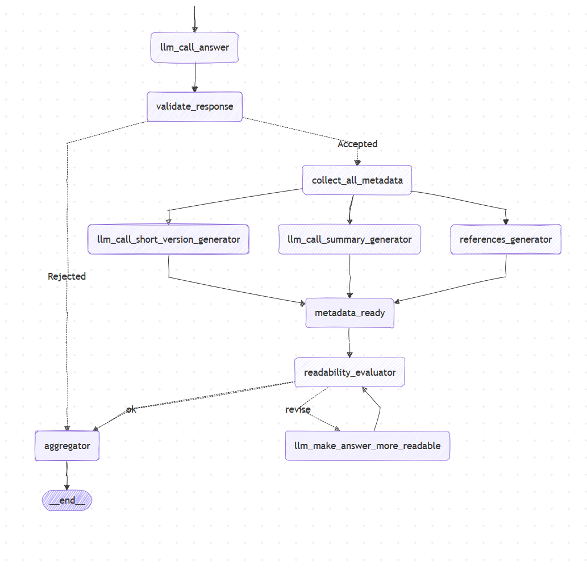
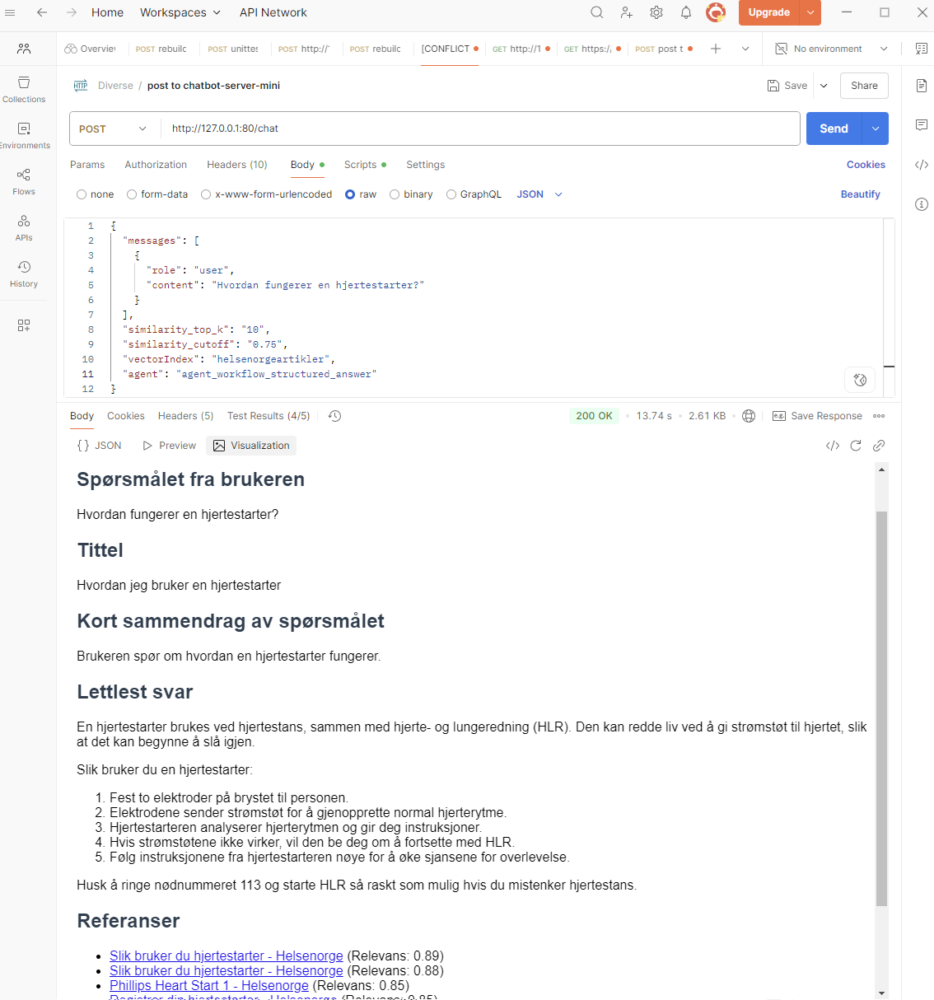

## Llama Index Server Application

A server application demonstrating Retrieval-Augmented Generation (RAG) with Azure OpenAI and LlamaIndex, powered by LangChain. This project, developed by **Helsedirektoratet** as part of the **HelseSvar** initiative, provides a chat-like server interface for querying and retrieving indexed health articles.

---

### Features

- **Azure OpenAI Integration**  
  Leverages Azure OpenAI models for advanced language understanding.

- **Vector Indexing**  
  Efficient storage and retrieval of text data using LlamaIndex.

- **Natural Language Queries**  
  Supports conversational queries over your indexed data.

- **Context-Aware Responses**  
  Generates answers grounded in relevant search results.

- **Agent Workflow**  
  Two interchangeable agents:  
  - **structured**  
    Orchestrates multi-step reasoning, composing responses with sections for short name, summary, answer, and references.  
  - **subqueries**  
    Decomposes the initial query into subqueries, answers each independently, then synthesizes a cohesive final answer.

- **Markdown Support**  
  All responses include Markdown formatting.

- **Streaming Support**  
  Both intermediate workflow actions and the final answer are delivered as a real-time event stream.

---

### Prerequisites

- **Python**: Version 3.13 or newer
- **Quart**: ASGI web framework for Python
- **Azure OpenAI Service**: An active resource with deployment name, API key, endpoint, and API version

---

### Installation

1. **Clone the repository**:
    ```bash
    git clone <repository_url>
    cd <repository_folder>
    ```

2. **Create a virtual environment** (optional but recommended):
    ```bash
    python -m venv .venv
    source .venv/bin/activate  # On Windows: .\.venv\Scripts\activate
    ```

3. **Install dependencies**:
    ```bash
    pip install -r requirements.txt
    ```

---

### Configuration

1. **Create a `.env` file** in the project root with the following keys:
    ```dotenv
    AZURE_OPENAI_MODEL=<your_model_name>
    AZURE_OPENAI_DEPLOYMENT_NAME=<your_deployment>
    AZURE_OPENAI_API_KEY=<your_api_key>
    AZURE_OPENAI_AZURE_ENDPOINT=<your_endpoint>
    AZURE_OPENAI_API_VERSION=<your_api_version>
    OPENAI_API_KEY=<your_openai_key>  # Optional if using Azure only
    ```

2. **Data Indexing**
   - By default, the application indexes health articles from the folder:
   ```
   blobstorage/chatbot/helsenorgeartikler
   ```
   - The repository includes a prebuilt vector index of 1,853 pages from Helsenorge.no.
   - unzip the file helsenorgeartikler.zip in the same folder

---


### Project Structure

```

   ├── .env                                     # Secret keys
   ├── requirements.txt
   ├── app.py                                   # Main application entry point
   ├── config.py                                # Server configuration loader
   ├── answer_utils.py                          # Query handling and answer generation
   ├── query_utils.py                           # Query parsing utilities
   ├── routes/                                  # HTTP route definitions
   ├── agent_workflow_structured_answer.py      # Agent workflow implementation
   └── blobstorage/chatbot/helsenorgeartikler   # Indexed article data
```

---

### Agent Workflow Visualization




### Running Locally

Start the server on port 80:

```bash
python app.py
```

Open your browser at `http://localhost:80` to interact with the chat interface.

---

### Testing with Postman

#### Download and install Postman:

- Visit https://www.postman.com/downloads/ and select the appropriate installer for your OS.

- Follow the installation prompts.

#### Create a new request:

- Open Postman and click New > HTTP Request.

- Set the method to POST and the URL to http://127.0.0.1:80/chat.

#### Configure the request body:

- Select Body > raw and choose JSON from the dropdown.


#### Paste the following JSON payload:
```bash

{
  "messages": [
    {
      "role": "user",
      "content": "Hvordan fungerer en hjertestarter?"
    }
  ],
  "similarity_top_k": "10",      # how many documents from the vectorindex to work with
  "similarity_cutoff": "0.75",   # index for simularity
  "vectorIndex": "helsenorgeartikler",  # vectorindex to work with
  "agent": "structured", # agent used for answering the query (you can use 'subqueries' or 'structured', se the agent names in AGENT_REGISTRY in route.py)
}
```

#### Send the request:

- Click Send.

- Inspect the response in the Postman console to verify the server's output. It shoud respond something like:
``` bash
{
    "answer": "# Oppsummering av spørsmålet\n\n## Spørsmålet fra brukeren\nHvordan fungerer en hjertestarter?\n\n## Tittel\nHvordan jeg bruker en hjertestarter?\n\n## Kort sammendrag av spørsmålet\nBrukeren spør om hvordan en hjertestarter fungerer.\n\n## Lettlest svar\nEn hjertestarter brukes ved hjertestans sammen med hjerte- og lungeredning (HLR). Når noen opplever hjertestans, kan en hjertestarter bidra til å gjenopprette en normal hjerterytme. \n\nSlik fungerer en hjertestarter:\n1. En hjertestarter brukes ved hjertestans. Den har to elektroder som festes på brystet til personen i hjertestans.\n2. Ved hjelp av disse elektrodene kan hjertestarteren gi ett eller flere strømstøt gjennom hjertet. Dette gir hjertet en sjanse til å starte på nytt med riktig rytme.\n3. Hjertestarteren analyserer hjerterytmen og gir instruksjoner om hva du skal gjøre. Hvis strømstøt ikke vil ha effekt, vil hjertestarteren be deg fortsette med hjerte- og lungeredning.\n4. Hjertestarteren vil også be deg om å stoppe HLR for å analysere hjerterytmen på nytt hvert tredje minutt.\n5. Dersom personen har ventrikkelflimmer eller ventrikkeltakykardi (kaotiske hjerterytmer), vil hjertestarteren anbefale å gi strømstøt ved å trykke på sjokknappen.\n6. Etter at strømstøt er gitt, må du fortsette med HLR inntil ambulansen kommer eller til du ser sikre tegn til liv.\n\nDet er viktig å følge hjertestarterens instruksjoner nøye og fortsette med hjerte- og lungeredning til ambulansepersonell overtar eller til personen viser tegn til liv.\n\n## Referanser\n- [Slik bruker du hjertestarter - Helsenorge](https://www.helsenorge.no/forstehjelp/bruk-av-hjertestarter/) (Relevans: 0.89)\n- [Slik bruker du hjertestarter - Helsenorge](https://www.helsenorge.no/forstehjelp/bruk-av-hjertestarter/) (Relevans: 0.88)\n- [Phillips Heart Start 1 - Helsenorge](https://www.helsenorge.no/forstehjelp/registrer-din-hjertestarter/phillips-heart-start-1/) (Relevans: 0.85)\n- [Registrer din hjertestarter - Helsenorge](https://www.helsenorge.no/forstehjelp/registrer-din-hjertestarter/) (Relevans: 0.85)\n- [Phillips Heartstart FRX - Helsenorge](https://www.helsenorge.no/forstehjelp/registrer-din-hjertestarter/phillips-heartstart-frx/) (Relevans: 0.85)\n- [Philips HeartStart FR3 - Helsenorge](https://www.helsenorge.no/forstehjelp/registrer-din-hjertestarter/philips-heartstart-fr3/) (Relevans: 0.84)\n- [Hjartestans – Ring 113 og start hjartekompresjonar - Helsenorge](https://www.helsenorge.no/sykdom/hjerte-og-kar/hjertestans/) (Relevans: 0.84)\n- [Hjerte- og lungeredning (HLR) - slik gir du livreddende førstehjelp - Helsenorge](https://www.helsenorge.no/forstehjelp/hjerte-og-lungeredning/) (Relevans: 0.84)\n- [Hjartestans – Ring 113 og start hjartekompresjonar - Helsenorge](https://www.helsenorge.no/sykdom/hjerte-og-kar/hjertestans/) (Relevans: 0.83)\n- [Primedic Heartsave ONE - Helsenorge](https://www.helsenorge.no/forstehjelp/registrer-din-hjertestarter/primedic-heartsave-one/) (Relevans: 0.83)\n"
}
```


---

### Deployment to Azure

1. **Create a Web App** on Azure with Python 3.13 runtime.
2. **General Settings**:
   - **Startup Command**: `bash startup.sh`
   - **SCM/FTPS Basic Auth**: Enabled
   - **Path Mapping**: `mountName=chatbot`, `mountPath=/blobstorage/chatbot`
3. **Deployment Center**:
   - Connect to your GitHub repo for continuous deployment.
4. **Blob Storage**:
   - Create a storage account and container named `chatbot`.
   - Upload the `helsenorgeartikler` folder to `chatbot` container.

---

Now you’re ready to explore health-related queries with RAG and agent-driven workflows!
