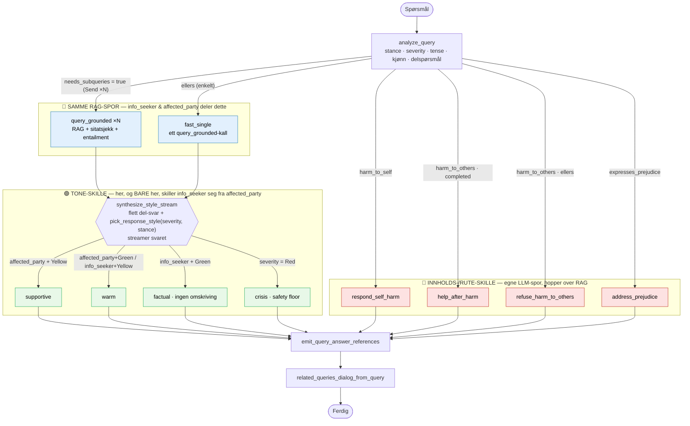

# Svarflyt — alle spor et spørsmål kan følge

Diagrammet under viser hele `answer_workflow` (definert i
[agent_workflow_answer.py](../agent_workflow_answer.py)): fra et spørsmål kommer
inn, gjennom klassifiseringen i `analyze_query`, og ut til ferdig svar.

Maskin-genererte utgaver av den samme grafen (rett fra LangGraph) ligger i
[graph.mmd](graph.mmd) og [graph.no.mmd](graph.no.mmd).

## Ett analyse-kall styrer alt

`analyze_query` gjør *hele* forarbeidet i **ett** LLM-kall (på `fast_llm`):
renskriver spørsmålet, setter severity (Green/Yellow/Red), stance,
`harm_to_others_tense`, `asker_gender`, og — når spørsmålet er sammensatt —
genererer delspørsmålene med det samme. Det finnes derfor **ingen egen
orchestrator-node** lenger; ruteren (`route_after_analysis`) fan-er workerne
ut direkte med en `Send`-liste.

## Tre typer skille

- 🔴 **Innholds-/rute-skille** — `harm_to_self`, `harm_to_others` (begge tempus)
  og `expresses_prejudice` får hver sin LLM-node fordi de trenger *annet
  innhold*. De forlater hovedflyten tidlig og hopper over både RAG og
  tone-omskriving.
- 🔵 **Samme RAG-spor** — `info_seeker` og `affected_party` går *begge* hit.
  Stance avgjør ikke veien; bare `needs_subqueries` gjør det (`fast_single`
  vs. parallelle `query_grounded`-workere).
- 🟢 **Tone-skille** — først i `synthesize_style_stream` skiller `info_seeker`
  seg fra `affected_party`, og kun i valg av stil (supportive / warm / factual
  / crisis). Samme node slår sammen del-svarene og *streamer* teksten
  token-for-token til klienten.

## Diagram

## Stance → spor

| stance | spor | hvordan svaret lages |
|--------|------|----------------------|
| `harm_to_self` | **respond_self_harm** | LLM, krisestøtte + hjelpetjenester. Mental Helse Ungdom garanteres i svaret. Ingen RAG |
| `harm_to_others` (completed) | **help_after_harm** | LLM, skadebegrensning + hjelpetjenester. Ingen RAG |
| `harm_to_others` (planning/unclear) | **refuse_harm_to_others** | LLM, avvisning + lovverk. Ingen RAG |
| `expresses_prejudice` | **address_prejudice** | LLM, møter holdningen uten å validere den. Ingen RAG |
| `info_seeker` / `affected_party` / `ambiguous` (enkelt) | **fast_single** | RAG, ett oppslag |
| `info_seeker` / `affected_party` / `ambiguous` (sammensatt) | **query_grounded ×N → synthesize_style_stream** | RAG, ett kall per delspørsmål med sitatsjekk + entailment-gate, så flettes de |

Alle fire LLM-nodene har en statisk fallback-tekst i
[registry.py](../registry.py) (`SELF_HARM_ANSWER`, `HELP_AFTER_HARM_ANSWER`,
`HARM_REFUSAL_ANSWER`, `PREJUDICE_ANSWER`) som brukes hvis LLM-kallet feiler,
og de velger hjelpetjenester fra katalogen i
[hjelpetjenester_ungdom.json](../hjelpetjenester_ungdom.json).

## Tone-valg (`pick_response_style`)

| stance | severity | → stil |
|--------|----------|--------|
| `affected_party` | Yellow | supportive |
| `affected_party` | Green | warm |
| `info_seeker` | Yellow | warm |
| `info_seeker` / `ambiguous` | Green | factual (ingen omskriving) |
| *hva som helst* | **Red** | crisis (safety floor — overstyrer alt, også klient-override) |

`factual` med bare **ett** gyldig del-svar streames rått ut uten LLM-kall.
`factual` med flere del-svar bruker en nøytral sammenstillings-prompt.

## Hvilken modell kjører hvor

| Kall | Modell |
|------|--------|
| `analyze_query` (renskriv + klassifisering + delspørsmål) | `fast_llm` |
| Entailment-gate og situasjons-filter i `query_grounded` | `fast_llm` |
| Utvelgelse av relaterte spørsmål | `fast_llm` |
| Grounded svar, harm-/fordoms-/selvskade-nodene, `synthesize_style_stream` | `llm` (hovedmodell) |

Tokens telles per modell (`input_tokens` / `output_tokens` mot
`fast_input_tokens` / `fast_output_tokens`) fordi de prises ulikt — se
`_compute_cost` i [agent_workflow_answer.py](../agent_workflow_answer.py).
